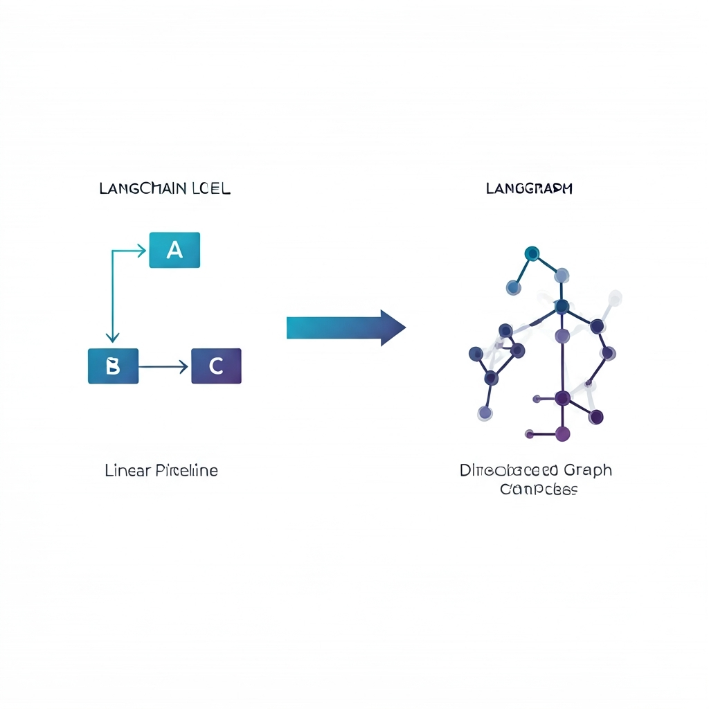
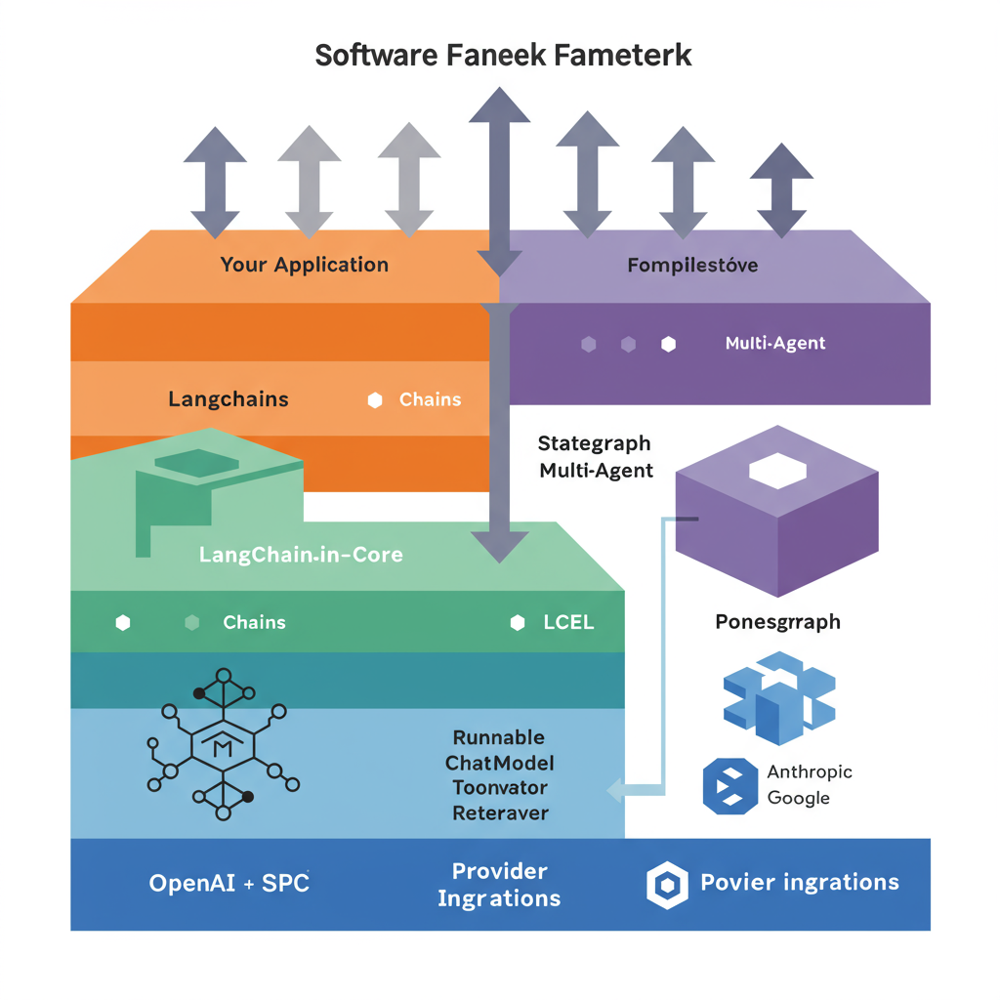
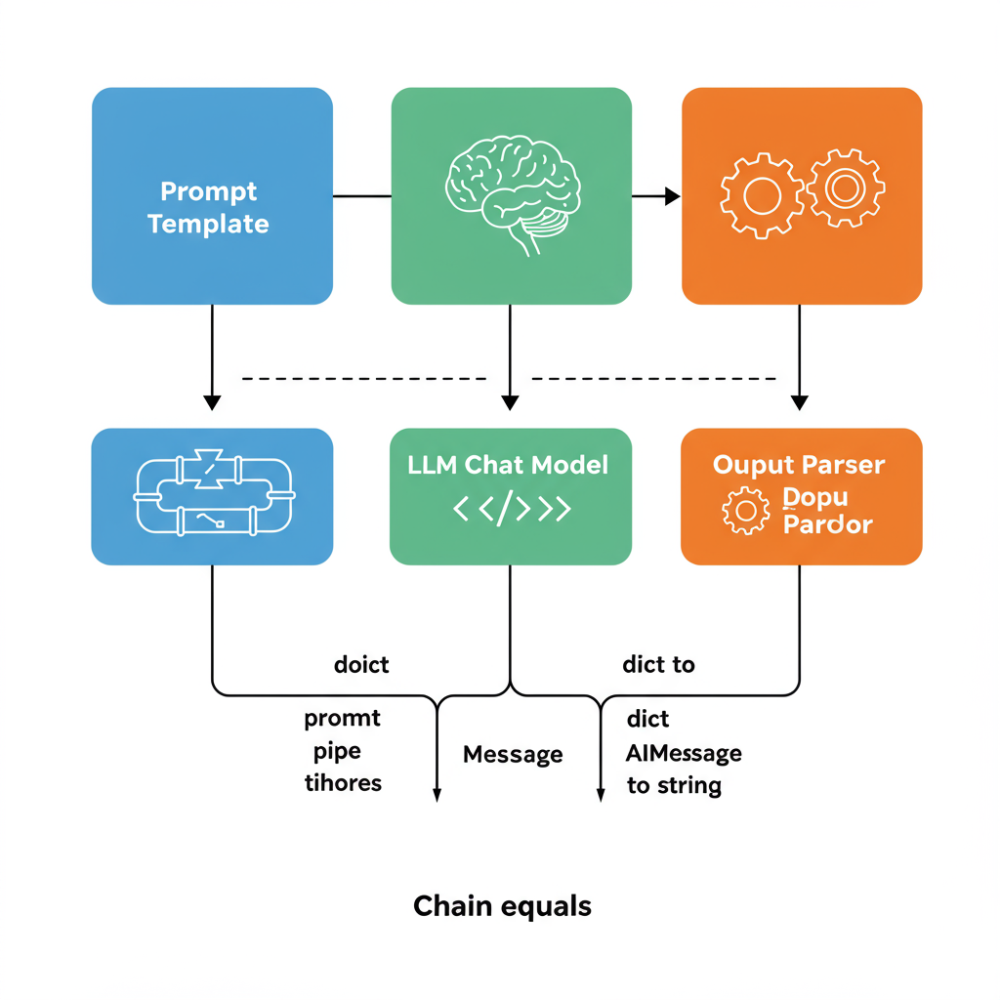
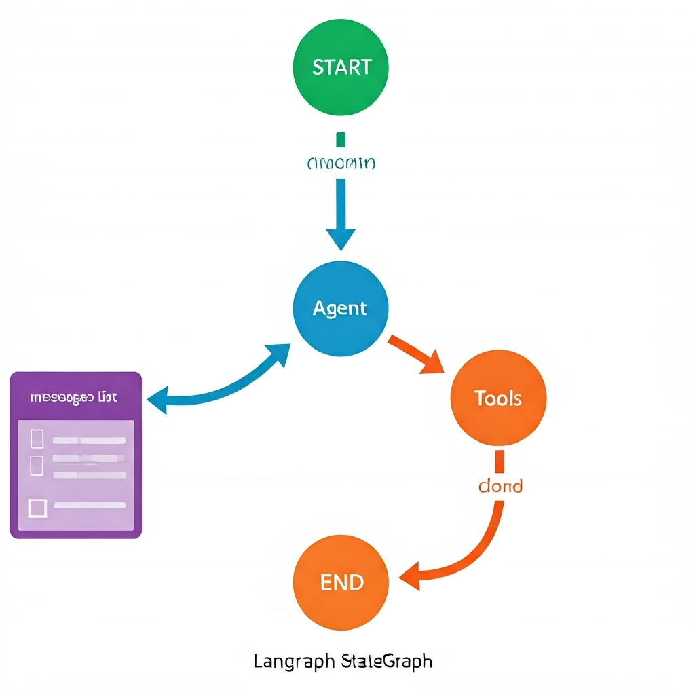
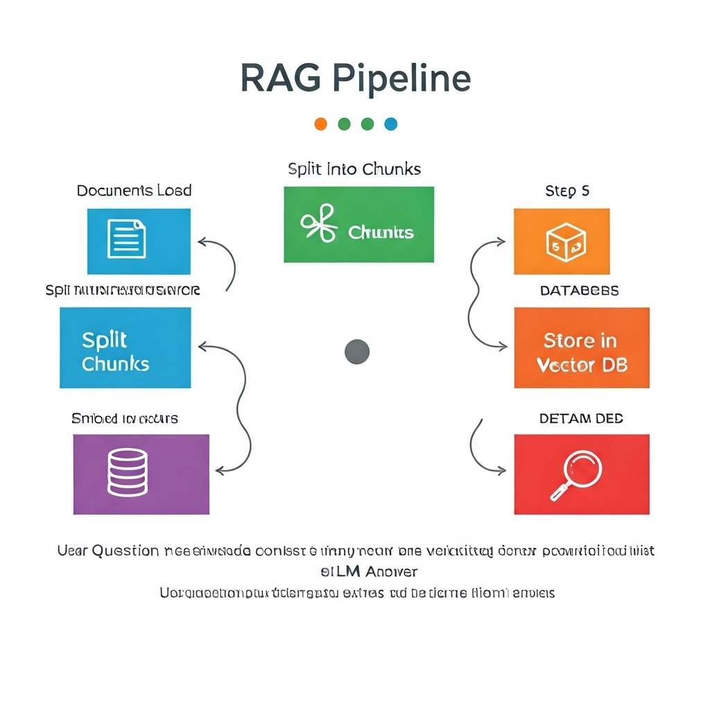
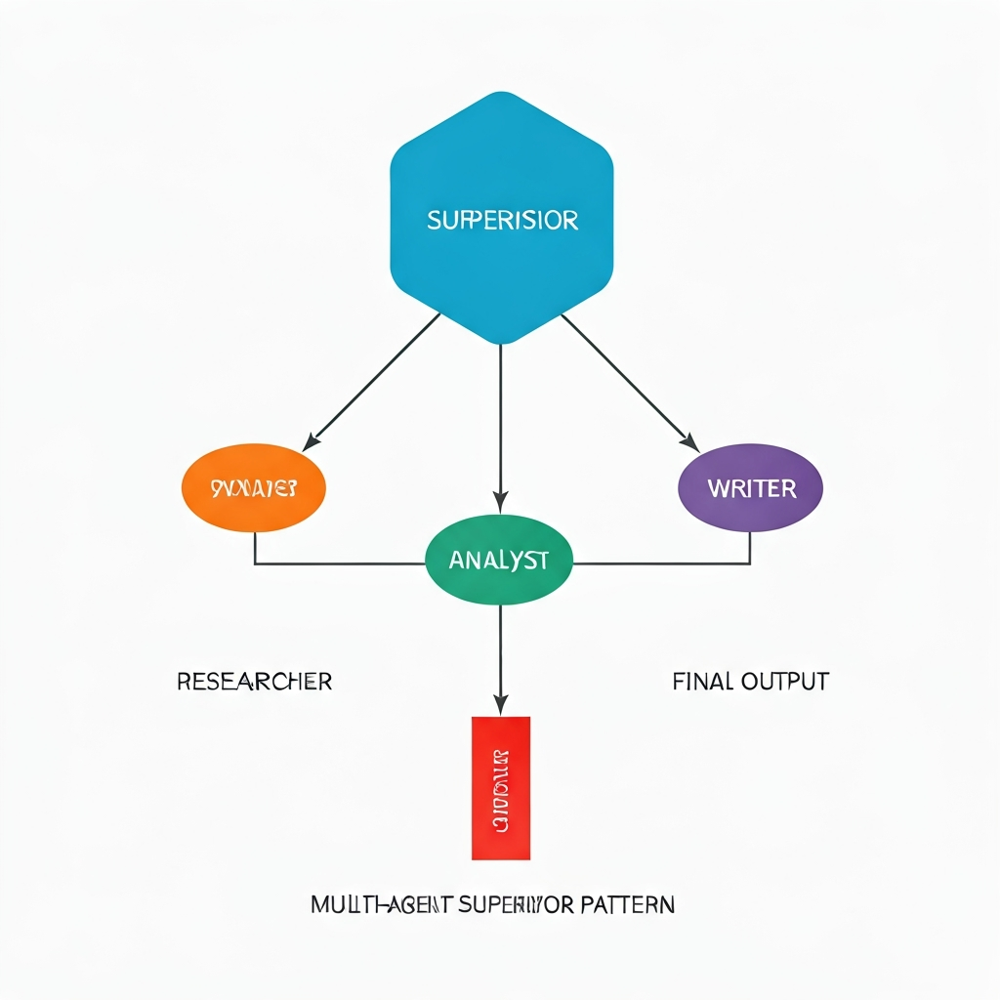
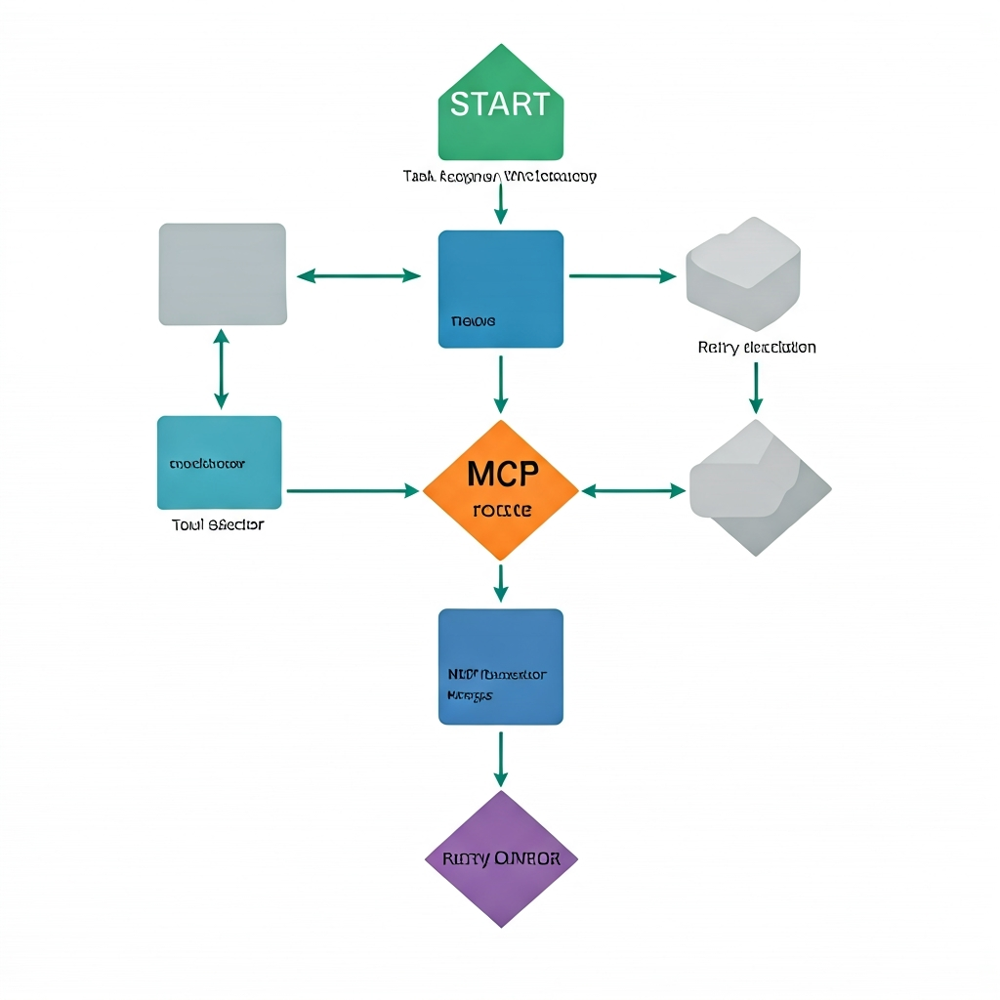

# AI Agent LangGraph 学习项目

基于 LangGraph 框架的 AI Agent 学习项目，从 LangChain 基础到 LangGraph 多智能体系统的完整学习路线。

---

## 框架定位

### LangChain vs LangGraph



**核心关系：** LangChain 解决"调用 LLM"，LangGraph 解决"控制 LLM"。两者共享 `langchain-core` 基础设施，不是替代关系，而是从简单到复杂的连续谱。

### LangChain 分层架构



```
langchain-core        ← 基础抽象层 (Runnable, LCEL, 基类)
├── langchain         ← 高级 API (chains, agents, middleware)
├── langchain-openai  ← OpenAI 集成
├── langchain-anthropic ← Anthropic 集成
└── langgraph         ← 图编排框架
```

### LCEL 管道组合



```python
# LangChain 最核心的范式：用 | 管道符组合组件
chain = prompt | model | parser
result = chain.invoke({"question": "什么是装饰器"})
```

---

## LangGraph 核心概念

### StateGraph — 有向图



```python
# 节点做事，边决定流向
graph = StateGraph(State)
graph.add_node("agent", agent_fn)
graph.add_node("tools", tool_fn)
graph.add_edge(START, "agent")
graph.add_conditional_edges("agent", route_fn)  # 条件路由
graph.add_edge("tools", "agent")                # 循环回到 agent
app = graph.compile()
```

### RAG 检索增强生成



```
文档加载 → 文本分割 → 向量嵌入 → 存入向量库 → 检索 + LLM 生成回答
```

### 多 Agent — Supervisor 模式



一个中央 Supervisor 分配任务给专业 Worker，Worker 完成后结果回到 Supervisor 决定下一步。

---

## 本项目工作流



```
START → task_assigner → tool_selector ──┬── mcp_executor → executor → reviewer ──┬── END
                                        │                                        │
                                        └── executor ────────────────────────────│
                                                                                 │
                                                          retry (< 6分 且 < 2次) ─┘
```

**关键 LangGraph 模式体现：**
- **StateGraph**: `AgentState` (Pydantic) 定义共享状态
- **条件路由**: `_should_use_mcp()` 决定走 MCP 还是直接执行
- **循环**: `_should_retry()` 审核不通过则重试
- **归约器**: `debug_logs` 和 `error_messages` 使用 `operator.add` 追加

---

## 学习文档

| 文档 | 内容 |
|------|------|
| [学习路线总览](./docs/00-learning-roadmap.md) | 6 个 Phase 的完整学习规划，含模块-知识点-代码映射 |
| [LangChain 核心概念](./docs/01-langchain-core.md) | Runnable、LCEL、ChatModel、Prompt、RAG、Agent |
| [LangGraph 核心概念](./docs/02-langgraph-core.md) | StateGraph、Node、Edge、Reducer、Checkpoint、HITL、多 Agent |
| [架构总览](./docs/03-architecture-overview.md) | 两者关系、选型指南、本项目架构解析 |
| [代码导读](./docs/04-code-guide.md) | 每个文件的关键行号标注，建议阅读顺序 |
| [进阶专题](./docs/05-advanced-topics.md) | HITL、Checkpoint、Streaming、Subgraph、Swarm、部署 |

---

## 项目结构

```
ai-agent-langgraph/
├── docs/                          # 学习文档
│   ├── 00-learning-roadmap.md     # 学习路线总览
│   ├── 01-langchain-core.md       # LangChain 核心概念
│   ├── 02-langgraph-core.md       # LangGraph 核心概念
│   ├── 03-architecture-overview.md # 架构总览
│   ├── 04-code-guide.md           # 代码导读
│   └── images/                    # 学习图示
├── src/                           # 源代码（多 Agent 工作流系统）
│   ├── models/                    # 状态模型定义
│   │   ├── base.py                #   基础模型 (Task, ExecutionResult...)
│   │   └── states.py              #   AgentState + 归约器
│   ├── agents/                    # Agent 实现
│   │   └── task_assigner.py       #   任务分配 Agent
│   ├── mcp/                       # MCP 工具集成
│   │   ├── client.py              #   MCP 客户端
│   │   ├── registry.py            #   工具注册表
│   │   ├── selector.py            #   工具选择器
│   │   └── executor.py            #   工具执行器
│   ├── utils/                     # 工具函数
│   │   └── state_manager.py       #   状态管理器
│   └── workflow/                  # 工作流编排
│       └── orchestrator.py        #   StateGraph 多 Agent 编排器
├── examples/                      # 示例代码
│   ├── basic_agent/               #   基础 Agent 示例
│   ├── multi_agent/               #   多 Agent 协作
│   ├── complex_workflow/          #   复杂工作流（条件分支/循环/错误处理）
│   └── mcp_integration/           #   MCP 工具集成
├── config/                        # 配置文件
├── demo.py                        # 系统演示入口
└── requirements.txt               # 依赖
```

### 代码与学习路线映射

```
src/models/states.py        → Phase 4: State 定义 + 归约器 (Annotated[List, operator.add])
src/workflow/orchestrator.py → Phase 4+5: StateGraph 构建、条件路由、多 Agent 编排
src/agents/task_assigner.py → Phase 3: Agent + Tool Calling
src/mcp/                    → Phase 3: 工具注册/选择/执行
src/utils/state_manager.py  → Phase 4: 状态持久化
```

---

## 快速开始

```bash
# 环境准备
python -m venv venv
source venv/bin/activate  # Linux/Mac

# 安装依赖
pip install -r requirements.txt

# 配置 API Key
cp config/.env.example config/.env
# 编辑 .env，填入 OPENAI_API_KEY

# 运行演示
python demo.py

# 或运行单个示例
python examples/basic_agent/simple_chatbot.py
```

## 学习路径

### Phase 1-3: LangChain 基础 → RAG → Agent

| 阶段 | 示例 | 知识点 |
|------|------|--------|
| 基础 Agent | [simple_chatbot.py](./examples/basic_agent/simple_chatbot.py) | ChatModel, Prompt, LCEL |
| 工具 Agent | [agent_with_tools.py](./examples/basic_agent/agent_with_tools.py) | @tool, ReAct 循环 |
| 多 Agent | [role_based_agents.py](./examples/multi_agent/role_based_agents.py) | 角色分工, 消息传递 |

### Phase 4-5: LangGraph 基础 → 进阶

| 阶段 | 示例 | 知识点 |
|------|------|--------|
| 条件分支 | [conditional_flows.py](./examples/complex_workflow/conditional_flows.py) | add_conditional_edges |
| 循环处理 | [loops_and_iteration.py](./examples/complex_workflow/loops_and_iteration.py) | 重试循环模式 |
| 错误处理 | [error_handling.py](./examples/complex_workflow/error_handling.py) | 异常恢复, 降级 |
| MCP 集成 | [file_tools.py](./examples/mcp_integration/file_tools.py) | MCP 工具注册与执行 |

### Phase 6: 完整系统

- **[demo.py](./demo.py)** — 运行完整的多 Agent 协作演示

## 技术栈

| 依赖 | 用途 |
|------|------|
| `langgraph` | 核心：StateGraph, 条件路由, Checkpoint |
| `langchain-core` | 基础：Runnable, Messages, Tools |
| `langchain-openai` | LLM：ChatOpenAI |
| `langchain-community` | 社区集成 |
| `pydantic` | 状态模型定义 |
| `faiss-cpu` / `chromadb` | 向量检索（可选） |

## 学习资源

- [LangChain Academy: Intro to LangGraph](https://academy.langchain.com/courses/intro-to-langgraph) — 官方免费课程
- [LangChain 文档](https://python.langchain.com/)
- [LangGraph 文档](https://langchain-ai.github.io/langgraph/)
- [MCP 协议规范](https://modelcontextprotocol.io/)

## License

MIT
